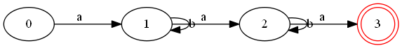
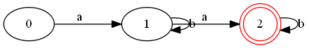
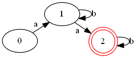
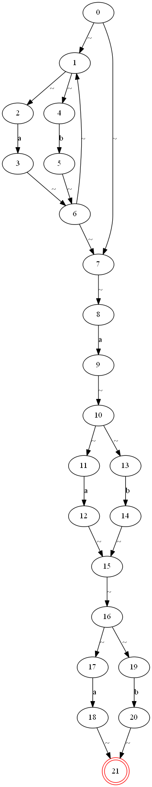
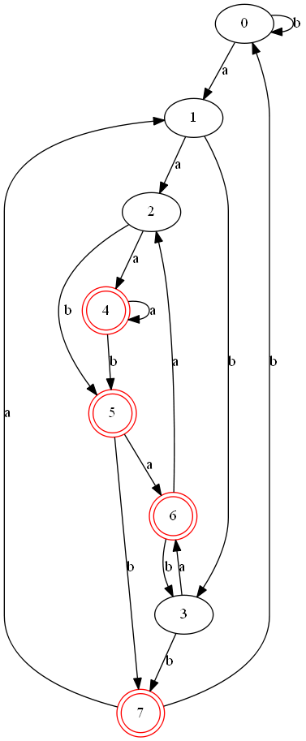

# demo展示

---


## re匹配字符串

终端输入 `./main -r "(ab*)ba*b" -s abac` 

打印结果

```bash
re_expresion: (ab*)ba*b
string_to_match: abac
error char: c !

*
match failed!
*

program over ...
```


## 手动输入模式

终端输入 `./main -i` 

执行程序, 打印

```bash
please input the re_expression:
->$
```

在 `$` 之后输入正则表达式

之后提示输入待匹配字符串

打印结果

```bash
please input the re_expression:
->$ ab*a*b
please input the string to match:
->$ abbbbbbbbbbbbbbaab

*
match succeeded!
*

program over ...
```


## re转化为min dfa图

终端输入 `./main -r "ab*ab*a" -o test.png -g m`

程序将表达式 `ab*ab*a` 转化为最小化的dfa图片, 保存在目录`./image/test_mindfa.png` 



***注: -o 代表系列名称, -g 指定生成模式为m(min_dfa), 所以图片对应名称为test_mindfa.png***


## 切换转化模式

终端输入 `./main -r "ab*ab*" -o test.png -g m`

得到如图所示min dfa 图



使用`-p fdp` 切换图片布局模式为 `fdp`

如图所示




## 复杂的demo

可以生成复杂的正则表达式的状态图

如 `./main -r "(a|b)*a(a|b)(a|b)" -o test.png -p dot` 生成下面的nfa图

>  (a|b)\*a(a|b)(a|b)是龙书3.9.4第二小问的题目

***~ 符号代表空串, 即 ε. 是由于ε无法用ASCII表示***



以及进行子集构造后的dfa图


最后是最小化的dfa图



可以不受画这种状态图的摧残了.