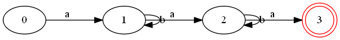
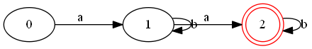
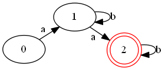
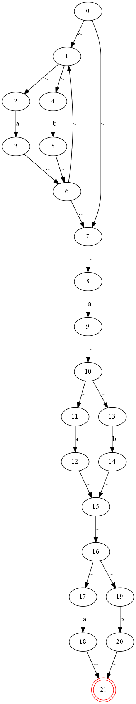
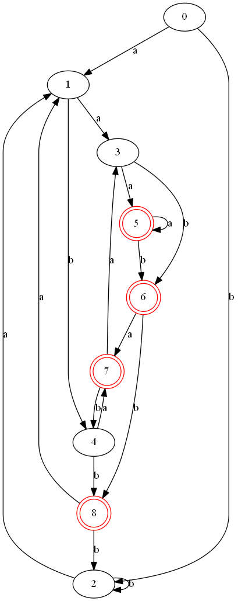
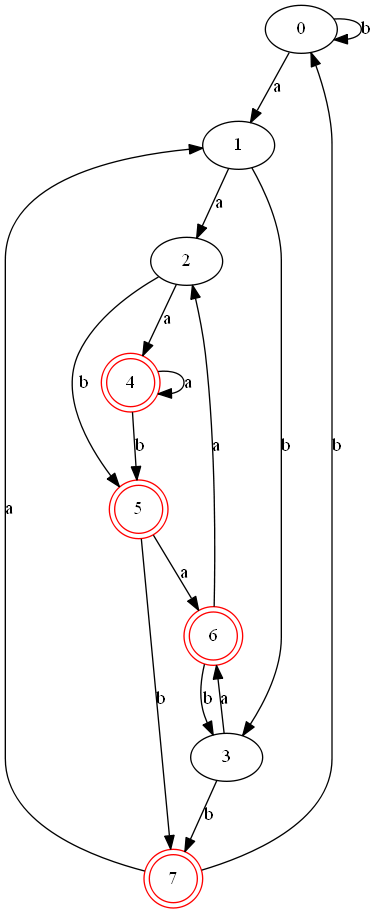

## 在线文档

[@author 姬小野](https://fiveplus.top)

[点击查看文档与Demo](https://fiveplus.top/re2graph)


## 项目依赖

此项目的图片生成部分依赖于项目 graphviz, [这是他们的主页](https://www.graphviz.org/) 

致谢~

如何安装 graphviz 可以参考[这篇文章](https://www.cnblogs.com/onemorepoint/p/8310996.html)

致谢~

**请安装好graphviz并配置好环境变量之后再使用本程序的画图功能. 字符串匹配功能不受影响**

配置好环境的标志是终端命令
`dot --version` 或者 `circo --version` 能正确执行.
确认操作无误可重启电脑再尝试


## 程序结构

在工程根目录下, 执行 `make` 编译程序, 可得到目标文件 `main.exe`

tmp 文件夹为临时文件, 保存了中间过程产生的nfa, dfa以及dot文件. 

image 文件夹为图片文件夹, 保存了生成的图片

如果出现make时无法识别`.o`文件的情况, 可以尝试`make -f Makefile-win`


## 正则表达式支持

支持以下简单规则

```bash
( )
*
+
[]
a-z
|
```

如 `[0-9a-zA-Z]+@(gmail|qq|163).com`

注意: **输入字符过多时**比如上面的re请不要开启 -g 的 d 参数. 因为边和点太多无法绘制出来. 注意, 默认不适用-g是会绘制三种图片的. **所以这种情况需要指定-g m 或者 -g nm才会正确执行程序. 不然会一直尝试绘制nfa图**


## 参数解析

执行 make 得到目标程序

输入 `./main -h` 得到参数提示

```bash
Usage: ./main [options hir:s:o:p:g:] [:argument]
options:
  -h
    说明: 打印提示信息并退出程序
  -i
    说明: 手动输入正则表达式 和 待匹配字符串
  -r <re_exp>
    说明: 作为模式的正则表达式
  -s <string>
    说明: 待匹配的字符串
  -o <png_file>
    说明: 要输出的png文件路径
  -p <pattern_name>
    说明: 输出的状态图要布局的模式: circo | dot | neato | twopi | fdp | patchwork
  -g <graph_type>
    说明: 要画的状态图的类型, 默认为三个类型: n | d | m, 可连起来写成字符串如 nm. 他们分别为 nfa | dfa | mindfa
demos:
  ./main -i
    说明: 手动输入正则表达式 和 待匹配字符串, 程序打印匹配结果
  ./main -r "(ab*|b)*ca*" -s aabbacaa
    说明: 用正则表达式 (ab*|b)*ca* 去匹配字符串 aabbacaa
  ./main -r "(ab*|b)*ca*" -o test.png
    说明: 将 正则表达式 (ab*|b)*ca* 转化到 test_nfa.png, test_dfa.png, test_mindfa.png 系列图片
  ./main -r "(ab*|b)*ca*" -o test.png -p dot
    说明: 用 dot模式 生成状态图
  ./main -r "(ab*|b)*ca*" -o test.png -p dot -g nm
    说明: 指定生成 nfa 和 mindfa 状态图

good luck!
```

## Demo展示

### re匹配字符串

终端输入 `./main -r "(ab*)ba*b" -s abac` 

打印结果

```bash
re_expresion: (ab*)ba*b
string_to_match: abac
error char: c !

*
match failed!
*

program over ...
```


### 手动输入模式

终端输入 `./main -i` 

执行程序, 打印

```bash
please input the re_expression:
->$
```

在 `$` 之后输入正则表达式

之后提示输入待匹配字符串

打印结果

```bash
please input the re_expression:
->$ ab*a*b
please input the string to match:
->$ abbbbbbbbbbbbbbaab

*
match succeeded!
*

program over ...
```


### re转化为min dfa图

终端输入 `./main -r "ab*ab*a" -o test.png -g m`

程序将表达式 `ab*ab*a` 转化为最小化的dfa图片, 保存在目录`./image/test_mindfa.png` 



***注: -o 代表系列名称, -g 指定生成模式为m(min_dfa), 所以图片对应名称为test_mindfa.png***


### 切换转化模式

终端输入 `./main -r "ab*ab*" -o test.png -g m`

得到如图所示min dfa 图



使用`-p fdp` 切换图片布局模式为 `fdp`

如图所示




### 复杂的demo

可以生成复杂的正则表达式的状态图

如 `./main -r "(a|b)*a(a|b)(a|b)" -o test.png -p dot` 生成下面的nfa图

>  (a|b)\*a(a|b)(a|b)是龙书3.9.4第二小问的题目

***~ 符号代表空串, 即 ε. 是由于ε无法用ASCII表示***



以及进行子集构造后的dfa图



最后是最小化的dfa图



可以不受画这种状态图的摧残了.